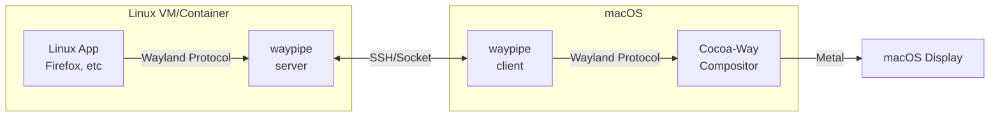

# Cocoa-Way

<div align="center">

[](https://github.com/J-x-Z/cocoa-way/releases)
[](https://github.com/J-x-Z/cocoa-way/actions)
[](https://www.gnu.org/licenses/gpl-3.0)
[](https://www.rust-lang.org/)
[](https://www.apple.com/macos/)
[](https://github.com/rust-unofficial/awesome-rust)
[](https://github.com/jaywcjlove/awesome-mac)

**Native macOS Wayland compositor for running Linux apps seamlessly**

[Demo Video](#-demo-video) • [Install](#-installation) • [Quick Start](#-quick-start) • [Architecture](#-architecture)

</div>

---

## Demo Video

[](https://youtu.be/VS3vQp5i8YQ)

> *True protocol portability: Cocoa-Way rendering Linux apps from SSH hosts, Docker, OrbStack, and Apple Container.*

## Features

| Feature                               | Description                                               |
| ------------------------------------- | --------------------------------------------------------- |
| **Native macOS**                | Metal rendering                                           |
| **Compositor Zero VM Overhead** | Direct Wayland protocol via socket, no virtualization     |
| **HiDPI Ready**                 | Optimized for Retina displays with proper scaling         |
| **Polished UI**                 | Server-side decorations with shadows and focus indicators |
| **Hardware Accelerated**        | Efficient Metal rendering pipeline                       |

## Installation

### Homebrew (Recommended)

```bash
brew tap J-x-Z/tap
brew install cocoa-way waypipe-darwin
```

### Download Binary

Download the latest `.dmg` or `.zip` from [Releases](https://github.com/J-x-Z/cocoa-way/releases).

### Build from Source

```bash
# Install dependencies
brew install libxkbcommon pixman pkg-config

# Clone and build
git clone https://github.com/J-x-Z/cocoa-way.git
cd cocoa-way
cargo build --release
```

## Quick Start

> ⚠️ **Required:** You must install [waypipe-darwin](https://github.com/J-x-Z/waypipe-darwin) to connect Linux apps.
>
> ```bash
> brew tap J-x-Z/tap && brew install waypipe-darwin
> ```

1. **Start the compositor:**

   ```bash
   cocoa-way
   ```
2. **Connect Linux apps via SSH:**

   ```bash
   ./run_waypipe.sh ssh user@linux-host firefox
   ```

3. **Or add persistent connections in `~/.config/cocoa-way/connections.toml`:**

   ```toml
   [[connection]]
   name = "Ubuntu (Apple Container)"
   type = "container"
   container_runtime = "container"
   image = "docker.io/library/ubuntu:24.04"
   app = "weston-terminal"
   container_socket = "/tmp/cocoa-way/waypipe.sock"
   runtime_args = ["--rosetta"]
   ```

   Then use the menu bar inside Cocoa-Way to launch the connection.

### Container Runtimes

Cocoa-Way can now launch local container-backed apps through connection entries with `type = "container"`.

- `container_runtime = "container"` uses Apple's official [`container`](https://github.com/apple/container) CLI. Apple documents it as requiring Apple silicon and macOS 26+, and you must start its background service first with `container system start`.
- `container_runtime = "docker"` works with Docker Desktop and compatible CLIs.
- `container_runtime = "orb"` or `container_runtime = "orbstack"` works with OrbStack.

For Apple Container, Cocoa-Way uses `container run --publish-socket ...` so the waypipe socket is exported back to macOS without requiring a shared bind mount. For Docker and OrbStack, Cocoa-Way bind-mounts the host socket directory into the container and connects over that local socket.

## Architecture



## Comparison

| Solution            | Latency | HiDPI        | Native Integration | Setup Complexity |
| ------------------- | ------- | ------------ | ------------------ | ---------------- |
| **Cocoa-Way** | ⚡ Low  | ✅           | ✅ Native windows  | 🟢 Easy          |
| XQuartz             | 🐢 High | ⚠️ Partial | ⚠️ X11 quirks    | 🟡 Medium        |
| VNC                 | 🐢 High | ❌           | ❌ Full screen     | 🟡 Medium        |
| VM GUI              | 🐢 High | ⚠️ Partial | ❌ Separate window | 🔴 Complex       |

## Roadmap

- [X] macOS backend (METAL)
- [X] Waypipe integration
- [X] HiDPI scaling
- [ ] winit and objc update
- [ ] Multi-monitor support
- [X] Clipboard sync

## Troubleshooting

<details>
<summary><b>SSH: "remote port forwarding failed"</b></summary>

A stale socket file exists on the remote host. Our `run_waypipe.sh` script handles this automatically with `-o StreamLocalBindUnlink=yes`.

If running manually:

```bash
waypipe ssh -o StreamLocalBindUnlink=yes user@host ...
```

</details>

<details>
<summary><b>Apple Container support checklist</b></summary>

```bash
container system start
container run --rm -it ubuntu:24.04 /bin/bash
```

If Cocoa-Way cannot launch a configured Apple Container connection:

- Verify the `container` CLI is installed and available in `/usr/local/bin/container` or your `PATH`.
- Make sure the image contains `waypipe` and the app you configured in `app = "..."`.
- On first run, try a shell as the app command to confirm the image itself starts cleanly.

</details>

<details>
<summary><b>Can Cocoa-Way run local X11 apps directly?</b></summary>

Not yet. Cocoa-Way is focused on Wayland clients transported over waypipe. Running same-machine X11 apps as a full XQuartz replacement is still an open gap.

</details>

## Contributing

Contributions welcome! Please open an issue first to discuss major changes.

## License

[GPL-3.0](LICENSE) - Copyright (c) 2024-2025 J-x-Z
